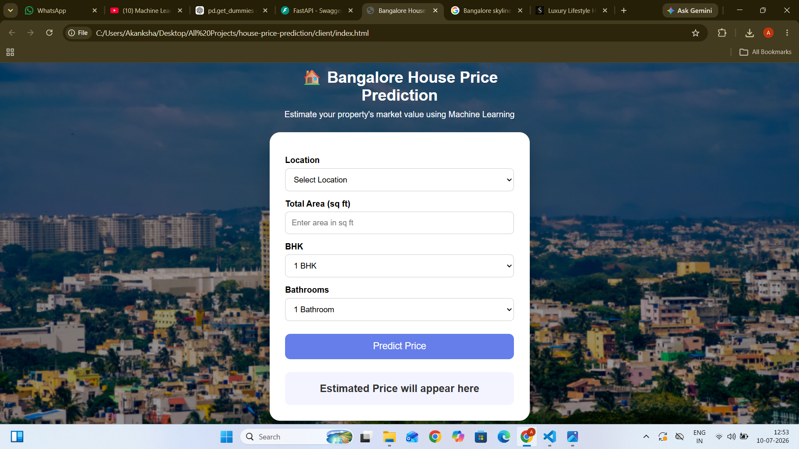
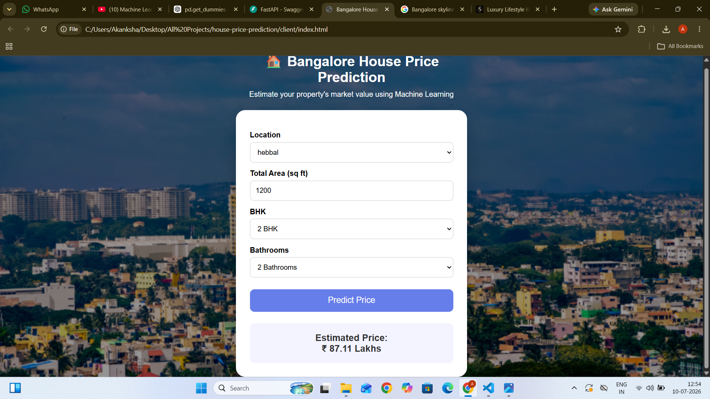
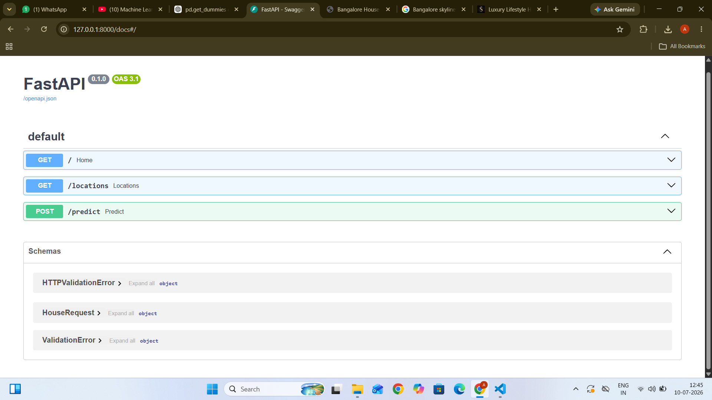
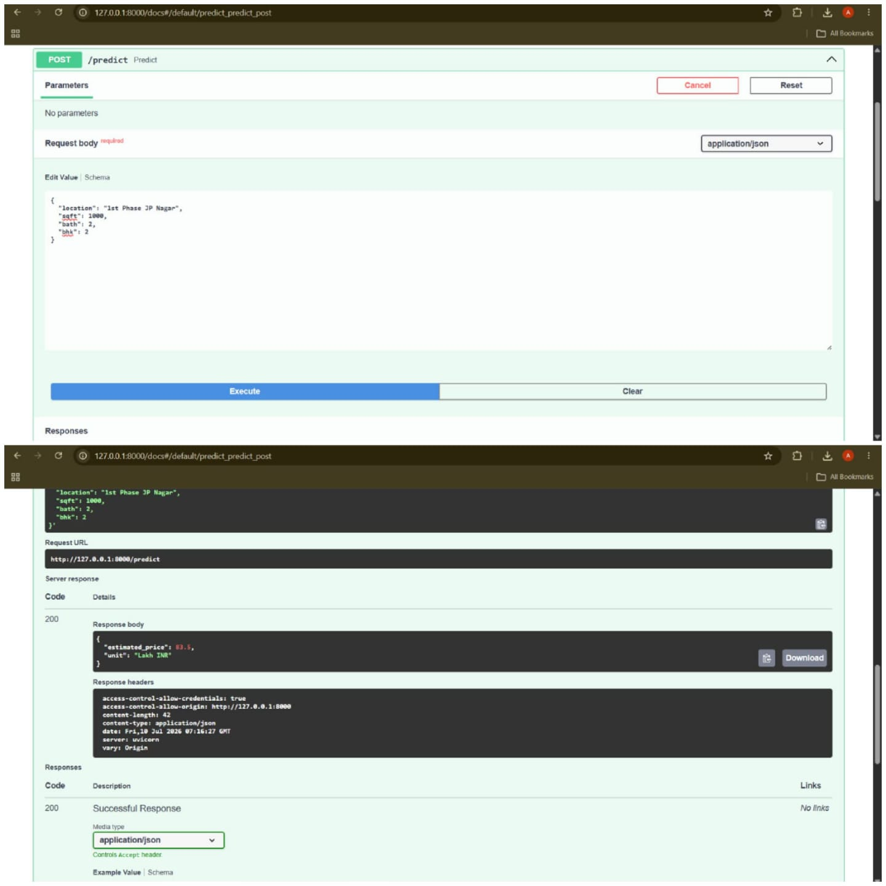

# 🏠 Bangalore House Price Prediction

An end-to-end Machine Learning application that predicts Bangalore house prices based on property features such as location, total area, BHK, and number of bathrooms. The trained regression model is deployed using **FastAPI** and integrated with a responsive web interface built using **HTML, CSS, and JavaScript**.

---

## 🚀 Project Demo

The application allows users to:

* Select a Bangalore location
* Enter property area (sqft)
* Select BHK and number of bathrooms
* Get an estimated house price instantly

---

## 📌 Problem Statement

Real estate prices depend on multiple factors such as location, size, and amenities. This project aims to build a machine learning model that can accurately estimate property prices in Bangalore based on historical housing data.

---

## 🛠️ Tech Stack

### Machine Learning

* Python
* NumPy
* Pandas
* Matplotlib
* Scikit-learn

### Backend

* FastAPI
* Uvicorn
* REST API

### Frontend

* HTML5
* CSS3
* JavaScript

### Deployment Concepts

* Model Serialization using Pickle
* API-based ML deployment
* Client-Server Architecture

---

## 🔄 Project Workflow

```
Data Collection
       |
       ↓
Data Cleaning & Preprocessing
       |
       ↓
Feature Engineering
       |
       ↓
Outlier Removal
       |
       ↓
One-Hot Encoding
       |
       ↓
Model Training
       |
       ↓
Hyperparameter Tuning
       |
       ↓
Model Saving (.pickle)
       |
       ↓
FastAPI Deployment
       |
       ↓
Frontend Integration
       |
       ↓
House Price Prediction
```

---

# 📊 Machine Learning Approach

## Data Preprocessing

Performed:

* Handling missing values
* Removing outliers
* Feature selection
* Location-based feature engineering
* One-hot encoding for categorical features

---

## Features Used

| Feature    | Description               |
| ---------- | ------------------------- |
| Location   | Area/locality of property |
| Total Sqft | Total property area       |
| BHK        | Number of bedrooms        |
| Bathroom   | Number of bathrooms       |

---

# 🤖 Model Development

Multiple regression models were evaluated using:

* Linear Regression
* Lasso Regression
* Decision Tree Regression

Model selection was performed using:

* GridSearchCV
* Cross Validation

The final trained model was saved using Pickle for deployment.

---

# ⚡ FastAPI Backend

The trained ML model is exposed through REST APIs.

## API Endpoints

### Home API

```
GET /
```

Response:

```json
{
    "message": "Bangalore House Price Prediction API"
}
```

---

### Get Locations

```
GET /locations
```

Returns all available Bangalore locations for prediction.

---

### Predict House Price

```
POST /predict
```

Request:

```json
{
    "location": "1st Phase JP Nagar",
    "sqft": 1000,
    "bath": 2,
    "bhk": 2
}
```

Response:

```json
{
    "estimated_price": 84.5
}
```

---

# 🖥️ Frontend Interface

The client-side application provides:

* Interactive user interface
* Location dropdown
* Property details input
* Real-time prediction display
* API communication using JavaScript Fetch API

---

# 📂 Project Structure

```
bengaluru-house-price-detection/

│
├── client/
│   ├── index.html
│   ├── style.css
│   └── script.js
│
├── server/
│   ├── main.py
│   ├── util.py
│   ├── requirements.txt
│   └── artifacts/
│       ├── columns.json
│       └── banglore_home_prices_model.pickle
│
├── screenshots/
│   ├── home_page.png
│   ├── prediction_result.png
│   └── fastapi_endpoints.png
|   └── fastapi_prediction_test.jpeg
│
├── README.md
└── .gitignore
```

---

# ▶️ How to Run the Project

## 1. Clone Repository

```bash
git clone <repository-url>
```

---

## 2. Install Dependencies

Navigate to the server folder:

```bash
cd server
```

Install required packages:

```bash
pip install -r requirements.txt
```

---

## 3. Start FastAPI Server

Run:

```bash
uvicorn main:app --reload
```

Server will start at:

```
http://127.0.0.1:8000
```

---

## 4. Open API Documentation

FastAPI provides interactive documentation:

```
http://127.0.0.1:8000/docs
```

---

## 5. Run Frontend

Open:

```
client/index.html
```

using Live Server in VS Code.

---

## 📸 Screenshots

### Application Interface


### Prediction Result


### FastAPI Swagger Documentation


### API Prediction Test


# 🎯 Key Learnings

* Building a complete machine learning pipeline
* Data preprocessing and feature engineering
* Regression model development
* Hyperparameter tuning
* Saving and loading ML models
* Deploying ML models using FastAPI
* Building frontend-backend communication

---

# 🔮 Future Improvements

* Deploy application on cloud platforms
* Add more advanced regression models
* Improve UI/UX design
* Add user authentication
* Containerize application using Docker
* Implement automated model retraining pipeline

---

# 👩‍💻 Author

**Akanksha Agre**

Machine Learning | Data Science | Python | FastAPI
